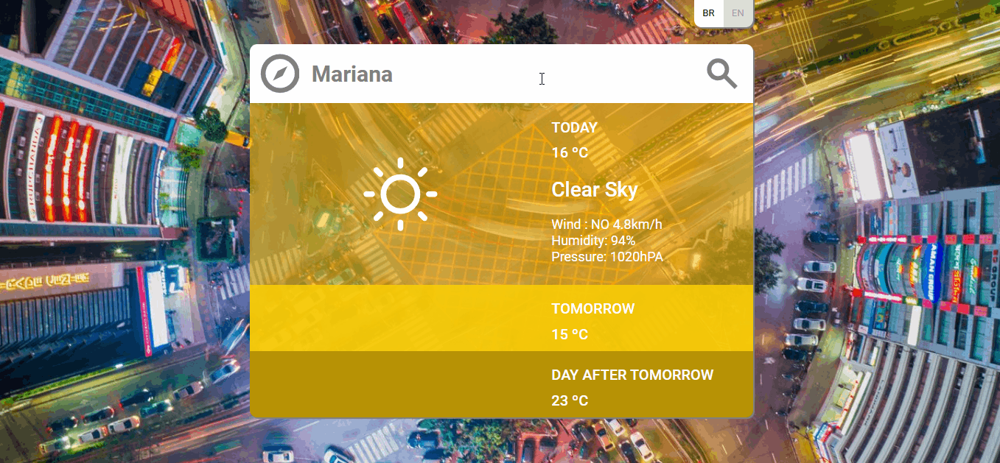

# Weather Forecast

Aplicação responsável por exibir as informações climáticas por cidades do mundo todo.

[[English](README.md) | [Portuguese](README.pt.md)]

  

<h2 align="center"> Tabela de Conteúdo </h2>

 <a href="#funcionalidades-principais">Funcionalidades Principais </a> -
 <a href="#estrutura-do-projeto">Estrutura do Projeto </a> -
 <a href="#tecnologias-utilizadas">Tecnologias Utilizadas </a> -
 <a href="#instrução-de-instalação">Instrução de instalação </a> -
 <a href="#melhorias-propostas--proximos-passos">Melhorias Propostas </a> -
 <a href="#dúvidas">Dúvidas </a>

## Funcionalidades Principais

Essa aplicação tem como objetivo exibir as condições climáticas de uma cidade escolhida pelo usuário. Inicialmente, utiliza a localização do usuário para mostrar as informações, que incluem a temperatura do dia, a velocidade e direção do vento, a pressão atmosférica e a previsão de temperaturas para os próximos dois dias.

## Estrutura do Projeto

O projeto foi dividido em um front-end e um back-end, cada um responsável por funções distintas:

### Back-end

O back-end é responsável por fazer requisições nas APIs consumidas pela aplicação, além de processar as informações que serão enviadas ao front-end. Ele realiza cálculos das principais fórmulas de conversão, como temperatura de Kelvin para Fahrenheit e Celsius, direção do vento (ângulo para direção cardinal) e velocidade de metros por segundo para quilômetros por hora. Também faz a seleção dos ícones que serão utilizados, evitando que o front-end precise realizar esses cálculos, o que promove uma aplicação mais rápida e leve.

As APIs consumidas estão listadas a seguir:

- OpenCageApi: responsável por transformar a localização atual do usuário em sua cidade através do reverse geocode.
- OpenWeatherApi: fornece os dados de clima e tempo que são exibidos na tela.
- BingApi: utilizada para coletar a imagem do dia, que é usada como background no front-end.

### Front-end

O front-end é responsável por receber e exibir as informações fornecidas pelo back-end de maneira visualmente agradável para o usuário. Ao carregar a aplicação, é coletada a imagem do dia do Bing para ser utilizada como fundo da interface.

O fluxo do usuário começa quando a aplicação coleta a localização do navegador e envia requisições ao back-end para obter informações sobre a cidade e as condições climáticas locais. A partir daí, o usuário tem a liberdade de modificar a cidade na parte superior da página e consultar o clima em qualquer lugar do mundo.

Entre as funcionalidades da aplicação, destaca-se o gradiente que ajusta suas cores de acordo com a temperatura: tons mais frios de azul para temperaturas abaixo de 15ºC e tons mais quentes de vermelho e laranja para temperaturas acima de 35ºC. Quando a aplicação não encontra a localização solicitada pelo usuário, exibe tons acinzentados e o ícone "NA" para indicar que nada foi encontrado. Além disso, é possível alternar entre exibir a temperatura em ºC e ºF (como o back-end já retorna ambos os valores calculados a troca é feita de forma instânea).

A aplicação utiliza ícones do Meteocons em toda a interface (para o resultado do clima, o ícone da guia, a bússola na cidade e o loader inicial), com excessão do ícone de lupa proveniente do Material Icons da Google.

Foram aplicados conceitos de responsividade para adaptar o comportamento da aplicação a diferentes dispositivos, especialmente [dispositivos móveis](mobile.pt.png).

O [layout sugerido](./exemplo.jpg) <link> foi seguido, porém com algumas modificações:

- A altura do componente onde as informações são exibidas foi reduzida e transformada em um card com cantos arredondados, proporcionando um visual mais moderno para a aplicação.
- Foi adicionado um ícone de pesquisa para facilitar a compreensão do usuário de que a parte em branco é uma caixa de texto editável que também funciona como botão de pesquisa, junto da tecla enter.
- Botões foram adicionados para alternar entre os idiomas inglês e português, ampliando o alcance de usuários que podem utilizar a aplicação.

## Tecnologias utilizadas
Para o front-end, a stack escolhida foi React. A criação do projeto foi feita com o Webpack, onde foi instalado o mínimo possível de dependências para a execução do projeto.

O back-end foi desenvolvido em Node.js, e toda a aplicação foi feita com o auxílio do TypeScript.

## Instrução de Instalação

Para utilizar a aplicação, você só precisa ter o Docker e um terminal (Windows ou Linux).

Siga estes passos para configurar a aplicação:

1. Clone o projeto utilizando o comando `git clone`.
2. Navegue até o diretório do projeto.
3. Execute o comando `docker-compose up`.
4. Aguarde a finalização da instalação. A aplicação de produção será concluída rapidamente, enquanto a de desenvolvimento levará um pouco mais de tempo devido às suas dependências.

As portas para acessar a aplicação são:

**Desenvolvimento:**
- Front-end: [http://localhost:8080](http://localhost:8080)
- Back-end: [http://localhost:4200](http://localhost:4200)

**Produção:**
- Front-end: [http://localhost:3001](http://localhost:3001)
- Back-end: [http://localhost:3333](http://localhost:3333)

## Melhorias Propostas / proximos passos

- **Aumento da Cobertura de Testes:** Garantir que mais componentes e funcionalidades sejam testados para garantir a manutenção a longo prazo do projeto.

## Dúvidas

Qualquer dúvida pode ser enviada para moraejosev@gmail.com, e terei o prazer em ajudar!